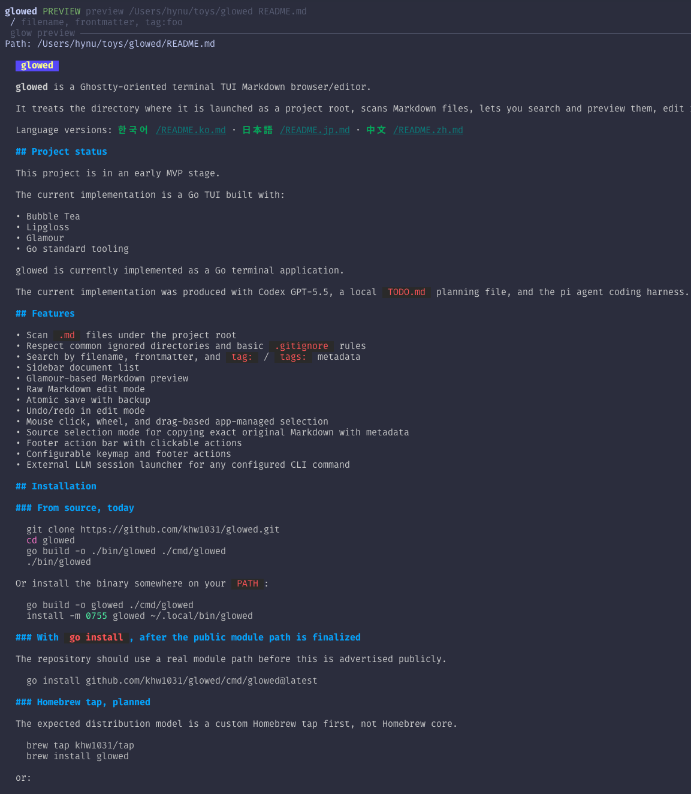
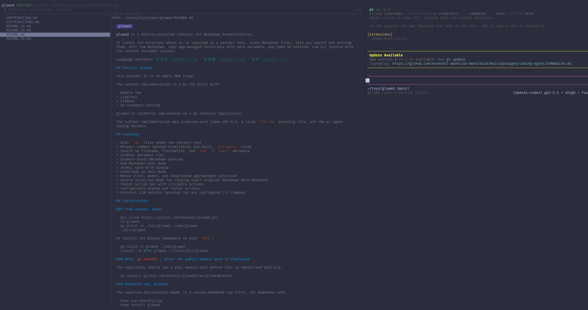

# glowed

**glowed** is a Ghostty-oriented terminal TUI Markdown browser/editor.

It treats the directory where it is launched as a project root, scans Markdown files, lets you search and preview them, edit raw Markdown, copy app-managed selections with path metadata, and open an external LLM CLI session with the current document context.

Language versions: [한국어](README.ko.md) · [日本語](README.jp.md) · [中文](README.zh.md)

## Screenshots





## Project status

This project is in an early MVP stage.

The current implementation is a Go TUI built with:

- Bubble Tea
- Lipgloss
- Glamour
- Go standard tooling

glowed is currently implemented as a Go terminal application.

The current implementation was produced with Codex GPT-5.5, a local `TODO.md` planning file, and the pi agent coding harness.

## Features

- Scan `.md` files under the project root
- Respect project-local `.glowedignore` scan rules
- Search by filename, frontmatter, and `tag:` / `tags:` metadata
- Sidebar directory tree with expandable/collapsible folders
- Glamour-based Markdown preview
- Raw Markdown edit mode
- Atomic save with backup
- Undo/redo in edit mode
- Mouse click, wheel, and drag-based app-managed selection
- Source selection mode for copying exact original Markdown with metadata
- Footer action bar with clickable actions
- Configurable keymap and footer actions
- External LLM session launcher for any configured CLI command

## Installation

### From source

```bash
git clone https://github.com/khw1031/glowed.git
cd glowed
go build -o ./bin/glowed ./cmd/glowed
./bin/glowed
```

Or install the binary somewhere on your `PATH`:

```bash
go build -o glowed ./cmd/glowed
install -m 0755 glowed ~/.local/bin/glowed
```

### With `go install`

```bash
go install github.com/khw1031/glowed/cmd/glowed@latest
```

### Homebrew tap

The distribution model is a custom Homebrew tap first, not Homebrew core.

```bash
brew tap khw1031/tap
brew install glowed
```

or:

```bash
brew install khw1031/tap/glowed
```

Forks and custom variants can publish their own taps, for example:

```bash
brew install SOMEONE/tap/glowed
```

## Usage

Open the current directory as the project root:

```bash
glowed
```

Open a specific project root:

```bash
glowed /path/to/project
```

Open a specific Markdown file:

```bash
glowed /path/to/project/notes/file.md
```

Show help:

```bash
glowed --help
```

## Default key bindings

- `q`: quit
- `/`: focus search
- `tab`: cycle focus; when a sidebar directory is selected, expand/collapse it
- `enter`: open selected document / focus preview; when a sidebar directory is selected, expand/collapse it
- `e`: edit current document
- `v`: source selection mode
- `c`: open external LLM session
- `ctrl+s`: save in edit mode
- `ctrl+z`: undo in edit mode
- `ctrl+y`: redo in edit mode
- `esc`: cancel search/edit/source mode depending on context
- `r`: rescan project root
- `ctrl+g b`: toggle sidebar
- `ctrl+g l`: open external LLM session
- `ctrl+g r`: rescan
- `ctrl+g q`: quit

## Configuration

Configuration is loaded from:

1. `~/.config/glowed/config.json`
2. `<project-root>/.glowed.json`

Project-local config overrides global config.

Markdown scan ignore rules are loaded only from `<project-root>/.glowedignore`. The syntax is gitignore-style; use `/build/` for the root build directory only, or `build/` for every directory named `build`.

See:

- [`glowed.schema.json`](glowed.schema.json)
- [`.glowed.example.json`](.glowed.example.json)
- [`.glowedignore`](.glowedignore)

## Release changelog drafts

Before a release, generate LLM-drafted notes from the git log and diff, then publish the reviewed contents in `CHANGELOG.md`:

```bash
scripts/draft-changelog.sh vX.Y.Z --llm-cmd "codex exec --sandbox read-only -"
scripts/update-changelog.sh vX.Y.Z .release/notes-vX.Y.Z.md
scripts/extract-release-notes.sh vX.Y.Z /tmp/glowed-release-notes-vX.Y.Z.md
```

The generated `.release/` files are local draft artifacts. The public source of truth for each release is the version section in `CHANGELOG.md`; GitHub Release notes should be extracted from that section.

## External LLM sessions

`glowed` does not handle OAuth, passwords, or API keys directly.

Instead, it opens the external CLI command configured in `llm.command` and passes the current Markdown context through a temporary context file and clipboard prompt. The user is expected to have already installed and logged in to that CLI in their terminal environment.

`claude` and `codex` are examples, not the only supported commands. You can point `llm.command` to any interactive CLI on your `PATH`, including another LLM CLI or your own wrapper script.

Supported intent:

- Launch the CLI configured in `llm.command`
- Examples: `claude`, `codex`, `aider`, or a custom wrapper script
- Apply small command-specific launch defaults for known commands such as Claude/Codex when useful
- Open a Ghostty split when possible
- Include current file path, relative path, mode, optional selection, and optional raw Markdown context

## Important limitations

Please read this section before using or distributing the project.

### Ghostty-first, not terminal-universal

`glowed` is currently designed around Ghostty. It may run in other terminals, but other terminal environments are not first-class targets yet.

Known risk areas:

- Mouse tracking
- Drag selection
- Wheel events
- `Cmd+Left` / `Cmd+Right` and other platform-specific key sequences
- Cursor shape behavior
- Alternate screen behavior
- Clipboard fallback through OSC52
- Terminal split launching for external LLM sessions

### Limited environment testing

The project has not yet been tested across a broad set of environments.

In particular, these are not guaranteed yet:

- iTerm2
- Terminal.app
- Alacritty
- Kitty
- WezTerm
- VS Code integrated terminal
- SSH sessions
- tmux/screen
- Linux desktop terminals
- Windows Terminal / WSL

The strongest expected path today is macOS + Ghostty.

### External LLM launch is environment-sensitive

The external LLM launcher assumes that the selected CLI command is already installed and logged in.

Ghostty split support is especially tailored to Ghostty. Other terminals may need different commands or may only open a separate window.

### Preview selection is not source mapping

Preview selection copies rendered preview text with metadata. It does not accurately map rendered terminal coordinates back to exact Markdown source ranges.

For exact original Markdown copying, use:

- edit/raw mode selection
- `sourceSelect` mode (`v`)

### Early editor warning

The editor performs backup + atomic save, but this is still early software. Use version control for important documents.

## Custom distributions

Homebrew tap namespaces are the recommended way to distinguish modified builds.

- The same formula name, `glowed`, can exist in different taps.
- For example, `khw1031/tap/glowed` and `someone/tap/glowed` can both be distributed.
- Users should install with the full tap path, such as `brew install someone/tap/glowed`, to avoid ambiguity.
- You are encouraged to maintain and use your own tap/build freely for your workflow.
- A modified build may install the binary as `glowed` for drop-in use, or as `glowed-<name>` if it should coexist with other builds.
- This repository does not use external pull requests as the default contribution path.
- If you want to share your version back, please open a **Distribution registration** issue. The maintainer may review it and, if desired, prepare and merge changes here independently.
- If your build was customized with an AI agent or coding harness, it is recommended to state which agent/model/method you used.
- Known distributions may be listed in [`DISTRIBUTIONS.md`](DISTRIBUTIONS.md).

See [`CONTRIBUTING.md`](CONTRIBUTING.md) for contribution, distribution registration, and Homebrew tap guidance.

## Development

Run tests:

```bash
go test ./...
```

Run benchmarks:

```bash
go test -bench=. -benchmem ./internal/docs ./internal/render
```

Run locally:

```bash
go run ./cmd/glowed
```
